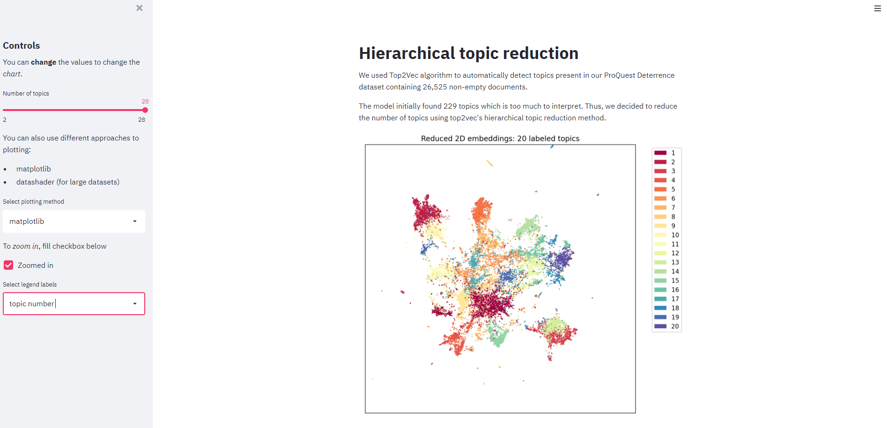
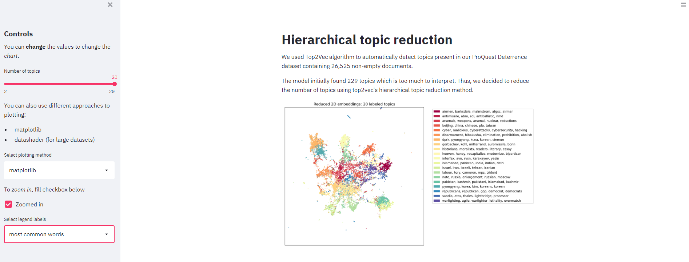
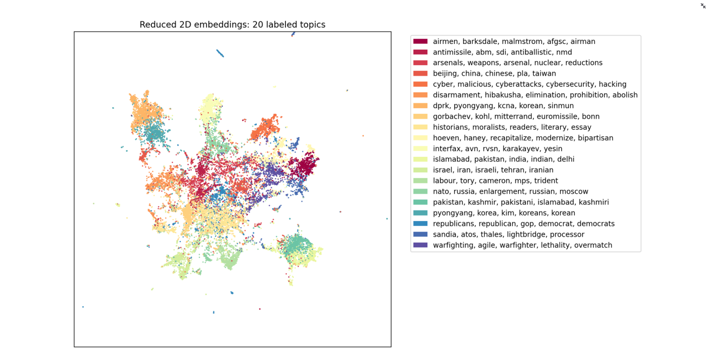

# streamlit-topic-reduction

This repository contains **streamlit** app that illustrates Top2Vec's hierarchical topic reduction method. 

## Usage

To use or contribute to this repository, first checkout the code. 
Then create a new virtual environment:

```console
$ git clone https://github.com/hcss-utils/streamlit-topic-reduction.git
$ cd streamlit-topic-reduction
$ python3 -m venv env
$ . env/bin/activate
$ pip install -r requirements.txt
```

To run the app, use `streamlit run`: 

```console
$ streamlit run app/main.py
```

Alternatively, use `make`:

```console
$ make env
$ . env/bin/activate
$ make install-dev
$ make app 
```

## Examples






